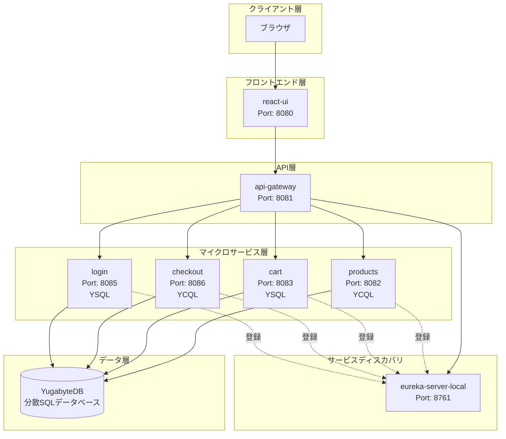

# Yugastore in Java


## 目次

1. [概要](#概要)
2. [主要特徴](#主要特徴)
3. [ドキュメント構成](#ドキュメント構成)
4. [技術スタック](#技術スタック)
5. [アーキテクチャ](#アーキテクチャ)
6. [ディレクトリ構造](#ディレクトリ構造)
7. [共通設計原則](#共通設計原則)
8. [クイックスタート](#クイックスタート)
9. [データベース設計](#データベース設計)
10. [スクリーンショット](#スクリーンショット)

---

## 概要

Yugastoreは、マイクロサービスアーキテクチャを採用したサンプルeコマースアプリケーションです。Spring Boot（Java）で構築された複数のマイクロサービス、Reactベースのフロントエンド、そして分散SQLデータベースであるYugabyteDBを組み合わせて、スケーラブルなオンラインマーケットプレイスを実現しています。

このアプリケーションは、本番環境を想定したクラウドネイティブなマイクロサービス設計パターンと、分散データベースの活用方法を学ぶためのリファレンス実装として活用できます。

### 主要特徴

- **マイクロサービスアーキテクチャ**: 6つの独立したSpring Bootマイクロサービスで構成
- **サービスディスカバリ**: Netflix Eurekaによる動的なサービス登録・検出
- **デュアルAPIデータアクセス**: YugabyteDBのYCQL（Cassandra互換）とYSQL（PostgreSQL互換）の両方を活用
- **マルチリージョン対応**: Kubernetes環境での分散デプロイメントに最適化
- **豊富なサンプルデータ**: 6,000件以上の商品データを含む
- **コンテナ対応**: Docker環境での実行をサポート
- **トランザクション処理**: 注文処理や在庫管理でACIDトランザクションを使用
- **ログ出力**: Spring Boot標準のログ機能を使用

---

## ドキュメント構成

リポジトリ内の各ドキュメントの一覧です。

1. **[README.md](README.md) - プロジェクト全体の概要と実行方法（読了時間: 約10分）**
   - システム概要とアーキテクチャの説明
   - 技術スタックとバージョン情報
   - ビルドと実行手順
   - スクリーンショット

2. **[resources/README.md](resources/README.md) - データロード手順の詳細（読了時間: 約5分）**
   - メタデータJSONのパース方法
   - Cassandra Loaderを使用したデータロード手順
   - YCQLでのデータクエリ例

3. **[resources/schema.cql](resources/schema.cql) - YCQLスキーマ定義（読了時間: 約3分）**
   - cronos keyspaceの定義
   - products、product_rankings、orders、product_inventoryテーブルの定義
   - インデックス定義

4. **[resources/schema.sql](resources/schema.sql) - YSQLスキーマ定義（読了時間: 約1分）**
   - shopping_cartテーブルの定義

5. **[docker-run.sh](docker-run.sh) - Dockerコンテナ起動スクリプト（読了時間: 約2分）**
   - 全マイクロサービスのDockerコンテナ起動手順

---

## 技術スタック

### 共通技術スタック

| カテゴリ | 技術 | バージョン |
|---------|------|-----------|
| 言語 | Java | 17 |
| ビルドツール | Maven | 3.x |
| コンテナ技術 | Docker | - |
| データベース | YugabyteDB | - |
| データロード | Python | 3.x |

### フレームワーク・ライブラリ

| カテゴリ | 技術 | バージョン |
|---------|------|-----------|
| アプリケーションフレームワーク | Spring Boot | 2.6.3 |
| マイクロサービス基盤 | Spring Cloud | 2021.0.0 |
| サービスディスカバリ | Netflix Eureka | - |
| REST クライアント | OpenFeign | - |
| データベースドライバ | Yugabyte Java Driver | 4.6.0-yb-10 |
| データベースドライバ | PostgreSQL Driver | - |

### フロントエンド技術スタック

| カテゴリ | 技術 | バージョン |
|---------|------|-----------|
| UIフレームワーク | React | 16.2.0 |
| ルーティング | React Router DOM | 4.2.2 |
| HTTPクライアント | Axios | 0.18.0 |
| CSSフレームワーク | Bootstrap | 3.3.7 |
| UIコンポーネント | React Materialize | 1.0.10 |

### 各マイクロサービス固有の技術スタック

| マイクロサービス | データアクセス | セキュリティ | 特記事項 |
|-----------------|---------------|-------------|---------|
| eureka-server-local | - | - | サービスレジストリ |
| api-gateway | OpenFeign | - | APIルーティング |
| products | Spring Data Cassandra (YCQL) | - | 商品カタログ管理 |
| cart | Spring Data JPA (YSQL) | - | ショッピングカート |
| checkout | Spring Data Cassandra (YCQL) | - | 注文処理 |
| login | Spring Data JPA (YSQL) | Spring Security, BCrypt | 認証機能（開発中） |
| react-ui | RestTemplate | - | フロントエンド |

---

## アーキテクチャ

### アーキテクチャ図（PNG）


### アーキテクチャ図（Mermaid）



### マイクロサービス一覧

| マイクロサービス | YugabyteDB API | デフォルトポート | 説明 |
| --------------- | -------------- | --------------- | ---- |
| [service discovery](eureka-server-local) | - | [localhost:8761](http://localhost:8761) | **Eureka**を使用したサービスディスカバリ。全マイクロサービスがEurekaに登録され、動的なサービス検出（ホスト名、IPアドレス、ポート等）を実現します。 |
| [react-ui](react-ui) | - | [localhost:8080](http://localhost:8080) | eコマースマーケットプレイスのReactベースUI。 |
| [api-gateway](api-gateway-microservice) | - | [localhost:8081](http://localhost:8081) | 外部APIリクエストを処理するゲートウェイ。UIはこのマイクロサービスとのみ通信します。 |
| [products](products-microservice) | YCQL | [localhost:8082](http://localhost:8082) | 商品カタログ全体を管理。カテゴリ別商品一覧、売上ランキング等の機能を提供します。 |
| [cart](cart-microservice) | YSQL | [localhost:8083](http://localhost:8083) | ショッピングカート機能。高可用性、低レイテンシ、マルチリージョン対応が求められます。 |
| [checkout](checkout-microservice) | YCQL | [localhost:8086](http://localhost:8086) | チェックアウト処理と注文管理。在庫管理も担当し、注文時の在庫確認を行います。 |
| [login](login-microservice) | YSQL | [localhost:8085](http://localhost:8085) | ユーザーのログインと認証を処理。*現在開発中です。* |

---

## ディレクトリ構造

```
yugastore-java-ig/
├── README.md                        # このファイル - プロジェクト全体の説明
├── pom.xml                          # 親Maven POM（マルチモジュール集約）
├── docker-run.sh                    # Dockerコンテナ起動スクリプト
├── yugastore-java-architecture.png  # アーキテクチャ図
├── LICENSE                          # ライセンスファイル
│
├── docs/                            # ドキュメント・スクリーンショット
│   ├── home.png                     # ホームページスクリーンショット
│   ├── product-category.png         # 商品カテゴリページ
│   ├── product.png                  # 商品詳細ページ
│   ├── cart.png                     # カートページ
│   └── checkout.png                 # チェックアウトページ
│
├── resources/                       # データベーススキーマとデータロードスクリプト
│   ├── README.md                    # データロード手順の説明
│   ├── schema.cql                   # YCQLテーブル定義
│   ├── schema.sql                   # YSQLテーブル定義
│   ├── dataload.sh                  # データロード実行スクリプト
│   ├── products.json                # 商品データ（6,000件以上）
│   ├── parse_metadata_json.py       # JSONパーサースクリプト
│   └── cassandra-loader             # Cassandraデータローダー
│
├── eureka-server-local/             # サービスディスカバリ（Port: 8761）
│   ├── pom.xml                      # Maven設定
│   ├── Dockerfile                   # Dockerイメージ定義
│   └── src/main/java/.../           # Eurekaサーバー実装
│
├── api-gateway-microservice/        # APIゲートウェイ（Port: 8081）
│   ├── pom.xml                      # Maven設定
│   ├── Dockerfile                   # Dockerイメージ定義
│   └── src/
│       └── main/
│           ├── java/.../controller/ # RESTコントローラー
│           ├── java/.../rest/clients/ # Feignクライアント
│           └── resources/           # 設定ファイル
│
├── products-microservice/           # 商品管理サービス（Port: 8082）
│   ├── pom.xml                      # Maven設定（YCQL依存）
│   ├── Dockerfile                   # Dockerイメージ定義
│   └── src/main/                    # 商品カタログ実装
│
├── cart-microservice/               # カートサービス（Port: 8083）
│   ├── pom.xml                      # Maven設定（YSQL依存）
│   ├── Dockerfile                   # Dockerイメージ定義
│   └── src/main/                    # ショッピングカート実装
│
├── checkout-microservice/           # チェックアウトサービス（Port: 8086）
│   ├── pom.xml                      # Maven設定（YCQL依存）
│   ├── Dockerfile                   # Dockerイメージ定義
│   └── src/main/                    # 注文処理実装
│
├── login-microservice/              # ログインサービス（Port: 8085）
│   ├── pom.xml                      # Maven設定（YSQL依存）
│   └── src/main/                    # 認証機能実装（開発中）
│
└── react-ui/                        # フロントエンド（Port: 8080）
    ├── pom.xml                      # Maven設定（frontend-maven-plugin）
    ├── Dockerfile                   # Dockerイメージ定義
    ├── frontend/                    # Reactアプリケーション
    │   ├── package.json             # npm依存関係
    │   └── src/                     # Reactソースコード
    └── src/main/java/.../           # Spring Bootバックエンド
```

---

## 共通設計原則

### レイヤードアーキテクチャ

本アプリケーションの各マイクロサービスは、レイヤードアーキテクチャ（階層化アーキテクチャ）を採用しています。各層は明確な責務を持ち、関心の分離を実現しています。

#### 各層の役割

**Controller層（プレゼンテーション層）**

Controller層は、外部からのHTTPリクエストを受け付け、適切なService層のメソッドを呼び出します。リクエストのバリデーション、レスポンスの整形、HTTPステータスコードの設定などを担当します。`@RestController`アノテーションを使用してRESTful APIエンドポイントを定義します。

**Service層（ビジネスロジック層）**

Service層は、アプリケーションのビジネスロジックを実装します。複数のRepository層のメソッドを組み合わせた処理、トランザクション管理、ビジネスルールの適用などを担当します。`@Service`アノテーションを使用してSpringのDIコンテナに登録されます。

**Repository層（データアクセス層）**

Repository層は、データベースとの通信を担当します。CRUD操作の実装、クエリの実行、データのマッピングなどを行います。Spring Data JPAまたはSpring Data Cassandraを使用して、データアクセスの抽象化を実現しています。

**Domain層（ドメインモデル層）**

Domain層は、ビジネスドメインを表現するエンティティやバリューオブジェクトを定義します。データベーステーブルとのマッピング（`@Entity`、`@Table`アノテーション）や、ドメイン固有のロジックを含みます。

#### 依存関係のルール

レイヤードアーキテクチャでは、以下の依存関係ルールを遵守します。

1. **上位層から下位層への依存のみ許可**: Controller層はService層に依存でき、Service層はRepository層に依存できます。しかし、下位層が上位層に依存することは禁止されています。

2. **同一層内の依存は最小限に**: 同じ層内のコンポーネント間の依存は避け、必要な場合は上位層を経由して連携します。

3. **インターフェースによる抽象化**: 層間の依存はインターフェースを通じて行い、実装の詳細を隠蔽します。これにより、テスタビリティと保守性が向上します。

```
┌─────────────────────────────────────┐
│         Controller層                │  ← HTTPリクエスト/レスポンス
│    （REST API エンドポイント）        │
└─────────────────┬───────────────────┘
                  │ 依存
                  ▼
┌─────────────────────────────────────┐
│          Service層                  │  ← ビジネスロジック
│    （ビジネスルール実装）             │
└─────────────────┬───────────────────┘
                  │ 依存
                  ▼
┌─────────────────────────────────────┐
│         Repository層                │  ← データアクセス
│    （データベース操作）               │
└─────────────────┬───────────────────┘
                  │ 依存
                  ▼
┌─────────────────────────────────────┐
│          Domain層                   │  ← エンティティ定義
│    （エンティティ・モデル）           │
└─────────────────────────────────────┘
```

---

## クイックスタート

### 8.1 コンテナ起動

#### 前提条件

- Java 17がインストールされていること
- Mavenがインストールされていること
- Docker（コンテナ実行の場合）がインストールされていること
- YugabyteDBがインストールされていること

#### ビルド

プロジェクトのルートディレクトリで以下のコマンドを実行してビルドします。

```bash
$ mvn -DskipTests package
```

#### Docker環境での起動

Dockerコンテナで実行する場合は、以下のスクリプトを実行します。

```bash
$ ./docker-run.sh
```

[Eurekaダッシュボード](http://127.0.0.1:8761/)で全サービスが登録されていることを確認後、[http://localhost:8080/](http://localhost:8080/)でアプリケーションにアクセスできます。

### 8.2 テストデータ格納

#### YugabyteDBのインストール

[YugabyteDBのインストール手順](https://docs.yugabyte.com/latest/quick-start/)に従ってインストールしてください。

#### YCQLテーブルの作成

```bash
$ cd resources
$ cqlsh -f schema.cql
```

#### YSQLテーブルの作成

```bash
$ cd resources
$ psql -f schema.sql
```

#### サンプルデータのロード

```bash
$ cd resources
$ ./dataload.sh
```

### 8.3 API起動とテスト

#### ホスト環境での各サービス起動

各マイクロサービスを別々のターミナルで起動します。

**Step 1: Eurekaサービスディスカバリの起動**

```bash
$ cd eureka-server-local/
$ mvn spring-boot:run
```

[Spring Eureka Service Discovery ダッシュボード](http://localhost:8761/)で起動を確認します。

**Step 2: APIゲートウェイの起動**

```bash
$ cd api-gateway-microservice/
$ mvn spring-boot:run
```

**Step 3: 商品マイクロサービスの起動**

```bash
$ cd products-microservice/
$ mvn spring-boot:run
```

**Step 4: チェックアウトマイクロサービスの起動**

```bash
$ cd checkout-microservice/
$ mvn spring-boot:run
```

**Step 5: カートマイクロサービスの起動**

```bash
$ cd cart-microservice/
$ mvn spring-boot:run
```

**Step 6: UIの起動**

```bash
$ cd react-ui
$ mvn spring-boot:run
```

アプリケーションは[http://localhost:8080/](http://localhost:8080/)でアクセスできます。

---

## データベース設計

### YugabyteDBのデュアルAPI戦略

YugabyteDBは、単一のデータベースで2つの異なるAPIを提供しています。本アプリケーションでは、各マイクロサービスの要件に応じて最適なAPIを選択しています。

### YCQL（Cassandra互換API）を使用するサービス

| サービス | 使用テーブル | 選択理由 |
|---------|-------------|---------|
| products | cronos.products, cronos.product_rankings | 商品カタログは読み取りが多く、柔軟なスキーマ進化が必要。ワイドカラムモデルにより、関連商品（also_bought, also_viewed等）のリスト型データを効率的に格納できる。 |
| checkout | cronos.orders, cronos.product_inventory | 注文データは書き込みスループットが重要。在庫管理はトランザクションを有効化して整合性を確保。 |

### YSQL（PostgreSQL互換API）を使用するサービス

| サービス | 使用テーブル | 選択理由 |
|---------|-------------|---------|
| cart | shopping_cart | ショッピングカートはACIDトランザクションが必要。ユーザーごとのカート操作で整合性を保証する必要があり、標準SQLの親和性が高い。 |
| login | users, roles | ユーザー認証はリレーショナルモデルが適切。ユーザーとロールの多対多関係をJOINで効率的に処理できる。 |

### スキーマ概要

#### YCQLスキーマ（cronos keyspace）

```
cronos.products          - 商品の静的属性（ASIN、タイトル、価格、画像URL、関連商品等）
cronos.product_rankings  - カテゴリ別の商品ランキング（売上順位）
cronos.orders            - 注文情報（トランザクション有効）
cronos.product_inventory - 商品在庫数（トランザクション有効）
```

#### YSQLスキーマ

```
shopping_cart - ショッピングカート（カートキー、ユーザーID、商品ASIN、数量）
```

### API選択の指針

YCQLとYSQLの選択は、以下の観点から判断します。

**YCQLを選択する場合**
- 高い書き込みスループットが必要
- スキーマの柔軟な進化が予想される
- リスト型やセット型のコレクションデータを扱う
- Cassandraの経験があるチーム

**YSQLを選択する場合**
- 複雑なJOINやサブクエリが必要
- 厳密なACIDトランザクションが必要
- 標準SQLの互換性を重視
- PostgreSQLの経験があるチーム

---

## スクリーンショット

### ホーム


### 商品カテゴリページ


### 商品詳細ページ


### カート


### チェックアウト


---

## ライセンス

このプロジェクトはオープンソースです。詳細は[LICENSE](LICENSE)ファイルを参照してください。

---

このデモアプリを使用される場合は、このリポジトリに :star: をお願いします！
